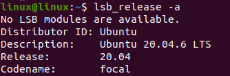
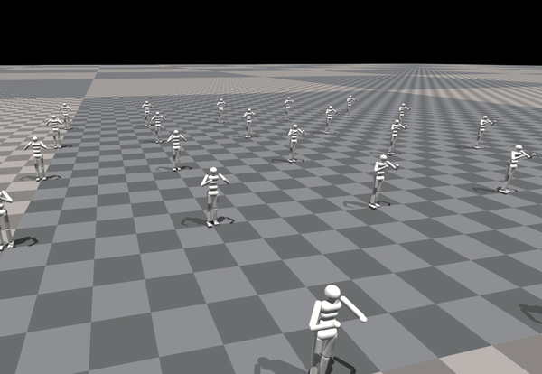
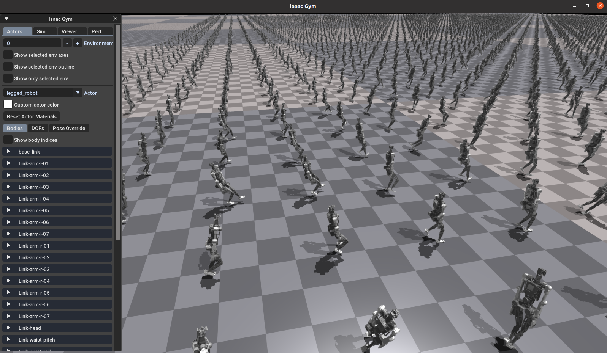
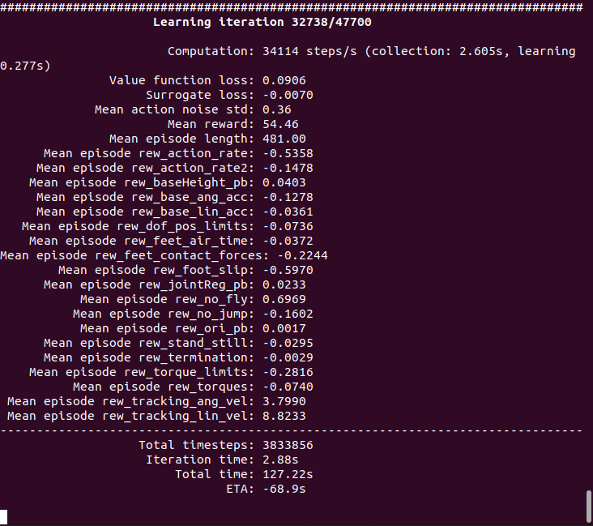
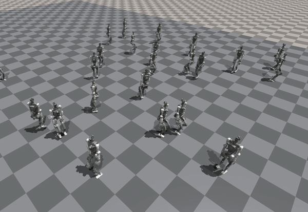

本文档旨在介绍如何使用Isaac gym仿真平台训练青龙机器人的控制算法。

# 强化学习教程
使用强化学习训练出的算法能够让青龙人型机器人更加稳定的行走，应对各种复杂地形和外部干扰。

## 环境配置
### 硬件需求
使用Isaac gym进行训练***刚需***一张支持***CUDA***功能的Nvidia显卡，为了流畅的进行训练以及可视化训练结果，推荐使用显存16G以上的RTX显卡。

验证：通过运行CUDA提供的示例程序或命令行工具（如nvcc --version）来验证CUDA是否安装。

### 系统配置
Isaac gym的训练需要在Linux系统上进行，我们推荐使用***Ubuntu20.04***，并将Isaac gym配置在conda虚拟环境中运行。

0. 配置好一个带有python（推荐使用***Python3.8***版本）的conda虚拟环境后我们便可以进行后续的环境安装工作。
   - `conda create -n AzureLoong python=3.8`
   - `conda activate AzureLoong`
1. 安装pytorch 1.13.1和cuda-11.7
   - `pip install torch==1.13.1+cu117 torchvision==0.14.1+cu117  --extra-index-url https://download.pytorch.org/whl/cu117`

2. 下载青龙安装包并安装Isaac gym
   - `git clone https://gitee.com/cheakccl/AzureLoong_v0.8`
   - `cd AzureLoong_v0.8/isaacgym/python && pip install -e .`
   - 通过运行示例检测是否安装正常

   - `cd examples && python joint_monkey.py`

   - 若安装出现问题可以尝试在`isaacgym/docs/index.html`文件中查找原因。
3. 安装gpu_rl
   - `cd AzureLoong_v0.8/AzureLoong/gpu_rl && pip install -e .`
4. 安装gpuGym
    - `cd AzureLoong_v0.8/AzureLoong && pip install -e .`
5. 安装WandB
    - `pip install wandb`

## 训练过程
### 开始训练
在gpugym/scripts路径下打开命令行界面，键入`python train.py --task=AzureLoong`开始训练。如果训练正常开始，会弹出gpugym的窗口：

按V可以暂停可视化，提升训练的速度

命令行中会显示每轮中奖励的平均数值：

### 成果展示
训练结束后键入`python play.py --task=AzureLoong`展示训练的结果

